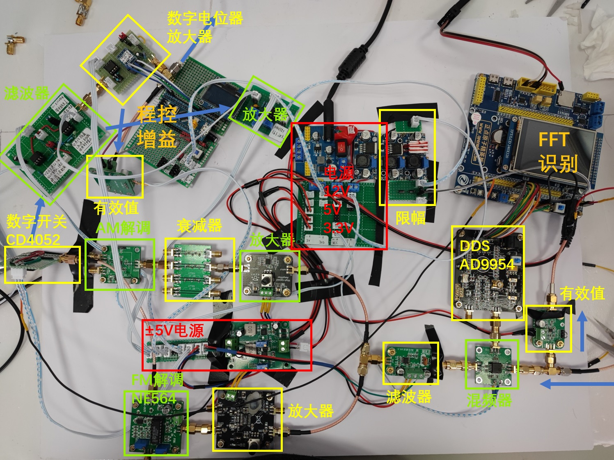

# 2023 电子设计竞赛 D题
东南大学吴院唯一一组打通信题的……还是大二。一开始觉得仪器仪表、电源、控制题人好多，卷不了一点，于是选了人最少的通信题。后来发现通信题人少不是没理由的，做不了一点。

## 基本思路
我们放弃了PSK解调波形（没见过，没模块，也没FPGA），放弃了FSK频偏测量（模块不支持），所以肯定没有国奖啦。<br>
使用的方法基本基于实验，投机取巧：

- 关于调制方式的识别：用FFT，找频谱特征。
- 关于测量AM调制深度：幅度映射到深度。分频率线性拟合，参数再以频率为变量分段线性拟合。
- 关于测量FM频偏：幅度映射到频率。范围内的用打表，近似，加随机数伪装；范围外的用拟合的曲线。
- 关于PSK频率的测量：发现用FM解调，一次相位变化有一个峰，所以可以测码率。
- 关于ASK和FSK的区分：实验发现两个信号有效值有差别，设个阈值区分。



全校就5组通信，我们的硬件最少（因为放弃了两个指标），按时完成；其他组在20点截止后一直搞到22点，超时了！结果一组都没进国赛。。。

## 代码
主要是ST的FFT库使用。[csdn上的代码](https://blog.csdn.net/weixin_43368814/article/details/103552114)有问题的，主要是输出的数组的位数。<br>

电赛第二天晚上写的代码，准备做多次fft取平均，需要一个累加数组。<br>
一开始声明在函数里（512位），卡死。声明在全局，一样。<br>
担心是内存不够，于是准备删掉不必要的数组。将复数转幅值的结果仍然存在OutBufArray里，删去了MagBufArray的定义，卡死。<br>
干脆在幅值数组MagBufArray里累加。能跑，但是结果不对。折腾了一会终于发现MagBufArray里的东西每次调用FFT都更新。<br>
结合以上两点，才发现原来OutBufArray应该定义为1024位，而不是像文章里说的512位（一半）。FFT库会使用输出数组的全部1024位，虽然后面一半和前一半是对称的。而文章里之所以能跑是因为他是这样定义的：

```C
long OutBufArray[NPT/2];          //定义输出数组
long MagBufArray[NPT/2];          //幅值
```

定义连在一起，组成了大的NPT位。所以FFT库一次改NPT位，当然两个都改了。<br>
验证了一下，把两个定义分开，果然挂了。于是修正了错误，同时删掉了不必要的数组（ADC缓存和InBufArray复用），还是卡死。不过这次是把累加数组声明在了函数内，爆栈了。声明为全局，终于跑通了。<br>
在b站反馈了这个问题，结果凌晨3点看到回复差点没气死我。好在最后都能好好说话了。
